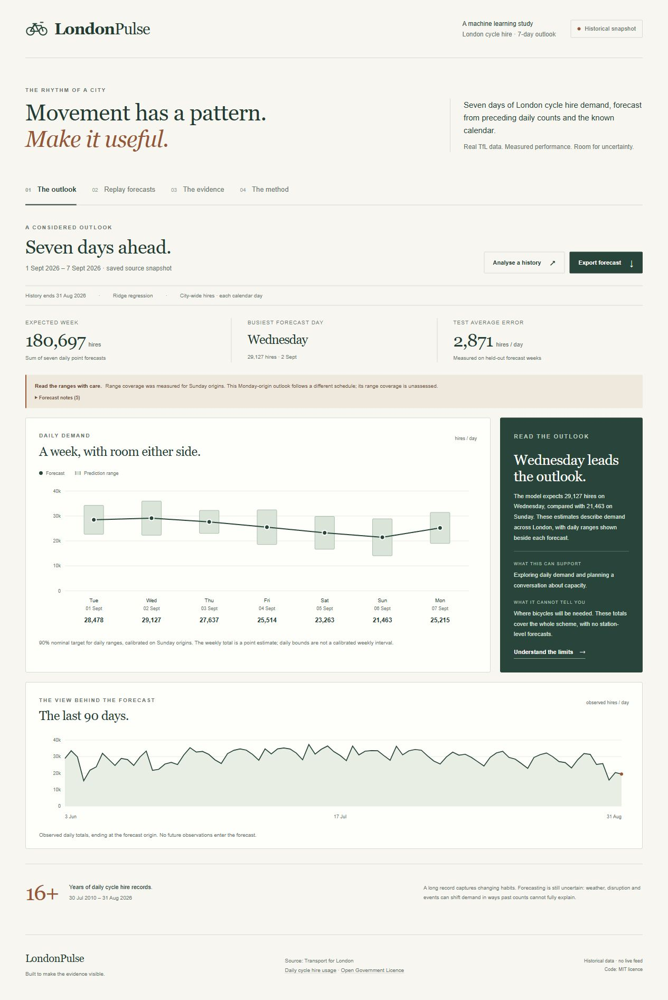
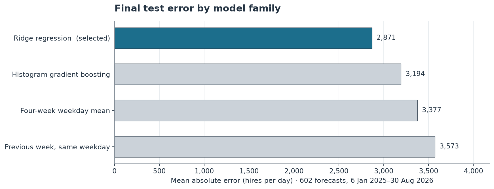
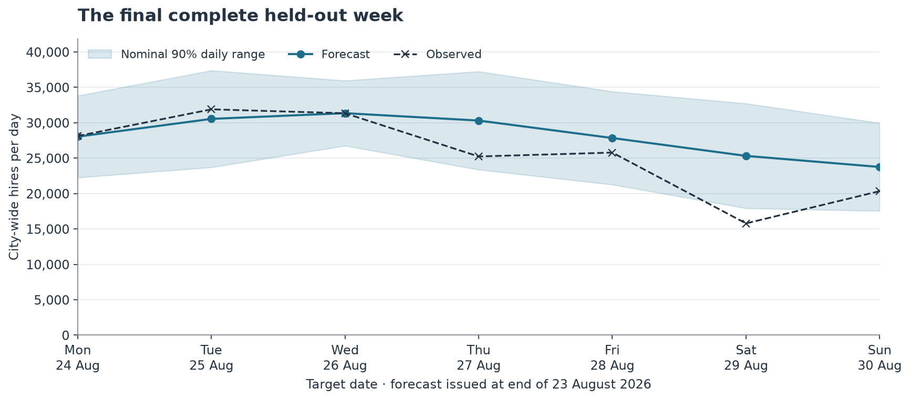

# LondonPulse

### The rhythm of a city, seven days ahead

[](https://www.python.org/)
[](LICENSE)
[](DATA_LICENSE.md)

**Forecast London's cycle hire totals. Replay what the model could predict. See where it falls short.** LondonPulse turns more than 16 years of official TfL observations into a complete forecasting experiment and an interactive research app.

The selected model achieves **2,870.58 hires/day average error** on **86 held-out weeks**, a **19.7% reduction** from repeating the previous week's weekday. The project includes the trained model, every scored forecast, an executed audit notebook and a documented source snapshot. The more complex tree model underperforms the selected linear model: the result determines the story.



## Explore the app

- **The outlook:** inspect seven daily point forecasts, empirical prediction ranges, a weekly point total and the preceding 90 days of observations.
- **Replay forecasts:** choose a held-out Sunday origin, step between weeks and reveal observed outcomes beside the forecasts. A daily table and CSV export keep the underlying values inspectable.
- **The evidence:** compare four model families, examine error and range coverage, and follow the chronological fitting, validation, calibration and test periods.
- **The method:** understand the causal features, source, information boundary and limits of aggregate forecasting.
- **Analyse a history:** upload or paste a `date,hires` CSV. Valid inputs receive a seven-day forecast from the fixed model. Uploads are validated and processed in memory.

This is an independent research project. The saved source ends on **31 August 2026**, and the illustrative outlook covers **1–7 September 2026**. It is a historical snapshot, with no live feed, TfL endorsement or station-level redistribution advice. Historical experiments use one revised source snapshot rather than original publication vintages.

## Run locally

Python **3.12** is recommended. The repository includes the trained model and app artefacts, so running the app requires no dataset download or model training.

```bash
git clone https://github.com/umarska/londonpulse.git
cd londonpulse
```

On Windows PowerShell:

```powershell
py -3.12 -m venv .venv
.venv\Scripts\python.exe -m pip install -e ".[dev,notebook]"
.venv\Scripts\python.exe app.py
```

On macOS or Linux:

```bash
python3.12 -m venv .venv
.venv/bin/python -m pip install -e ".[dev,notebook]"
.venv/bin/python app.py
```

Open **[http://127.0.0.1:5051](http://127.0.0.1:5051)**. For the recorded Python 3.12 environment, install `requirements-lock.txt` before installing the project with `-e . --no-deps`. The package pins scikit-learn 1.9.1 to match the trusted serialised model. For a different port, use `python app.py --port 5052` with your environment's Python.

A Docker recipe is included:

```bash
docker build -t londonpulse .
docker run --rm -p 5051:5051 londonpulse
```

The [validation record](docs/validation.md) distinguishes checks that were run from optional recipes.

## Measured results

The model family and hyperparameters were selected using **2023 validation MAE**, then the fitted families were refitted with target dates through **31 December 2023**. The final test covers **602 daily forecasts from 6 January 2025 to 30 August 2026**, issued from **86 non-overlapping Sunday origins**. All four families are compared on the same dates.

| Model | Validation MAE | Test MAE | Test RMSE | Test WAPE |
|---|---:|---:|---:|---:|
| Previous week, same weekday | 3,589.56 | 3,573.01 | 5,038.60 | 14.08% |
| Four-week weekday mean | 3,434.00 | 3,376.68 | 4,673.52 | 13.31% |
| Ridge regression | 3,178.12 | 2,870.58 | 3,984.85 | 11.31% |
| Histogram gradient boosting | 3,560.54 | 3,194.12 | 4,087.75 | 12.59% |

MAE and RMSE are **hires per day**, and lower is better. WAPE divides the total absolute error by total observed hires. **Ridge regression (`alpha=100`)** wins validation selection and the measured final test MAE. It reduces test MAE by **19.7% against the previous-week baseline**, and by **15.0% against the four-week weekday mean**. The model was chosen before the final test was scored.



## Uncertainty, measured as well as displayed

Each horizon's nominal 90% daily range uses absolute residuals from **51 earlier calibration weeks in 2024**. The finite-sample corrected 47th ordered residual gives its radius. On the final test, **543 of 602 daily outcomes (90.2%)** fall inside their ranges, whose mean width is **12,667 hires/day**.

These are broad empirical prediction ranges. Temporal dependence and changing demand prevent a guaranteed 90% probability for each day. **Day 3/Wednesday coverage is 80.2%**, despite the stronger overall figure. Because every evaluated origin is a Sunday, horizon and weekday are aligned; their effects cannot be separated. Non-Sunday interval coverage, including the illustrative Monday origin, has not been assessed. Adding daily bounds does not produce a calibrated interval for the weekly total.



## Reproduce the experiment

Use the verified, tracked daily snapshot for an offline run:

```bash
python -m londonpulse.train --project-dir . --skip-download
python -m pytest -q
python -m jupyter nbconvert --execute --to notebook --inplace notebooks/londonpulse_analysis.ipynb
```

Use your environment's Python path in those commands if it is not activated. The training run regenerates the model, validation/calibration/test CSVs, figures and app data. The notebook independently recomputes the metrics and intervals from those exports, checks chronological target boundaries and verifies count-derived features against available history.

To re-extract the pinned publisher workbook:

```bash
python -m londonpulse.train --project-dir .
```

An existing source file can be supplied with `--workbook /path/to/tfl-daily-cycle-hires.xlsx`. The pipeline verifies its SHA-256. A later revised publisher download deliberately fails the checksum check until its changes have been reviewed. The online command therefore may not reproduce this pinned release indefinitely; the tracked processed snapshot supports the offline reproduction path.

## Source and boundaries

The source is [Transport for London, Number of Bicycle Hires, London Datastore](https://data.london.gov.uk/dataset/number-of-bicycle-hires-2r84d), under [Open Government Licence v2.0](https://www.nationalarchives.gov.uk/doc/open-government-licence/version/2/). It contains **5,877 daily observations** from **30 July 2010 to 31 August 2026**. Only daily counts are extracted from the workbook; monthly and annual totals are excluded. Provenance records source and processed checksums, dates and quality checks.

The source documents a scheme shutdown on **10–11 September 2022**, with zero entries in the daily series. Those entries are preserved and disclosed, rather than treated as evidence of zero underlying demand. The metadata sheet contains an older end date than the actual daily series. Delayed events may revise historical figures; original publication vintages are not retained here.

The model uses **21 features** from past counts and known future calendar dates. It does not use future actual weather, bank holiday indicators or special events. Changing travel behaviour, service conditions and fleet availability can affect completed hires. City-wide totals cannot identify where bicycles are required, individual travel patterns or unmet demand. Uploaded data inherit the fixed model's domain and calibration limitations.

## Repository guide

| Path | Purpose |
|---|---|
| [`app.py`](app.py), [`static/`](static/) | Local app and bounded forecast API |
| [`src/londonpulse/`](src/londonpulse/) | Verified source preparation, causal features, training and inference |
| [`data/processed/`](data/processed/) | Tracked daily snapshot and source provenance |
| [`models/model.joblib`](models/model.joblib) | Trusted fitted Ridge model and frozen calibration radii |
| [`artifacts/`](artifacts/) | Per-date forecast CSVs, experiment configuration and app data |
| [`notebooks/londonpulse_analysis.ipynb`](notebooks/londonpulse_analysis.ipynb) | Executed, independently calculated audit with five figures |
| [`docs/methods.md`](docs/methods.md) | Feature definitions, temporal protocol, score formulas and range limitations |
| [`docs/model-card.md`](docs/model-card.md) | Model purpose, evaluation and appropriate use |
| [`tests/`](tests/) | Meaningful data, chronology, inference and API checks |

Original software and explanatory material: [MIT licence](LICENSE). Source observations: [data licence and attribution](DATA_LICENSE.md). Contains public sector information licensed under the Open Government Licence v2.0. Source: Transport for London via London Datastore.
